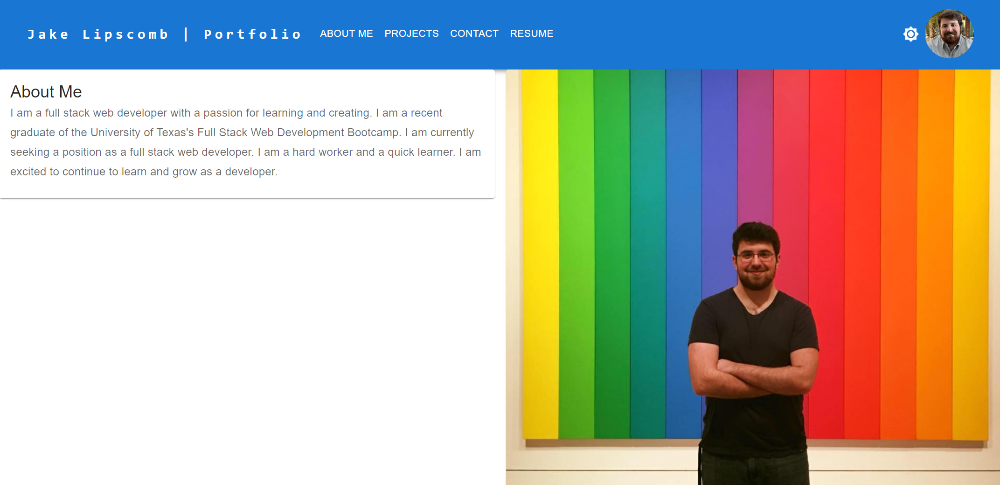
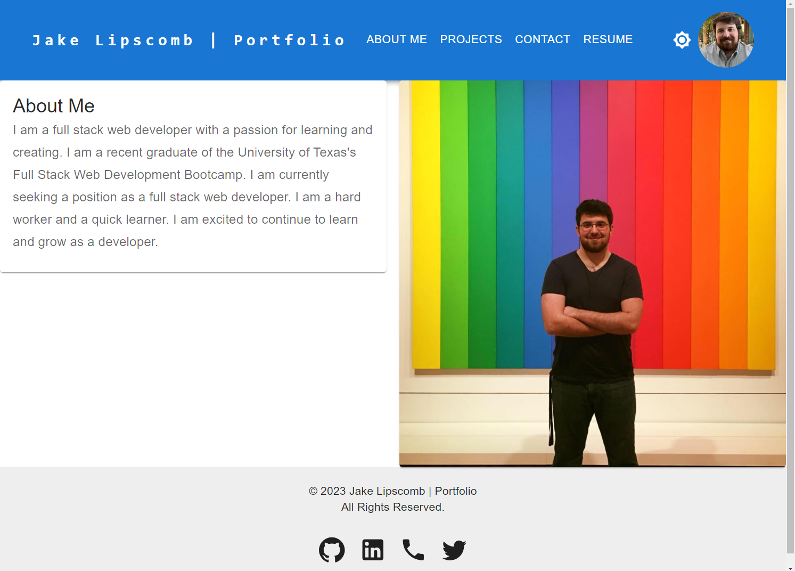
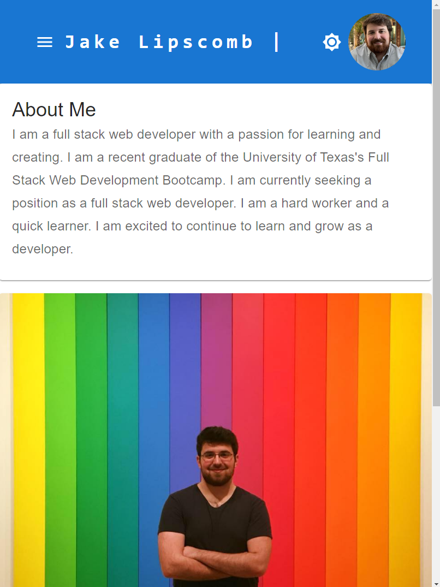

# React Portfolio
by Jake Lipscomb

## Screenshots

## Table of Contents
- [Description](#description)
- [Features](#features)
- [Contact](#contact)
- [License](#license)

## Description
This is my portfolio built with React and Material UI. It is a single page application that uses React Router to navigate between pages. It is fully responsive and mobile friendly. It is deployed on Netlify and can be viewed [here](https://jakelipscomb.netlify.app/).

## Features
- Single page application
- Fully responsive and mobile friendly
- React Router for navigation
- Material UI for styling

The application features the following pages:
- About Me - A short bio about me and my background
- Projects - A collection of my projects
- Contact - A contact form to send me a message
- Resume - A link to my resume

## Contact
Share your contact information and how others can reach out to you.

- GitHub: https://github.com/jakelipscomb
- LinkedIn: https://linkedin.com/in/jake-lipscomb
- Email: jlipscombtx95@gmail.com

## License
This portfolio is licensed under the [MIT License](LICENSE).
